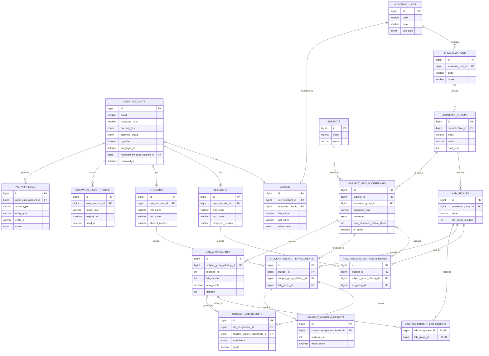

# MySQL ER Diagram

This diagram reflects [`schema.mysql.sql`](./schema.mysql.sql).

## Reading the model

- `subjects` is a shared catalog, while `subject_group_offerings` is the semester-specific teaching instance for one academic group.
- Every subgroup of the offering's academic group is implicitly part of the offering, so there is no `subject_offering_lab_groups` table anymore.
- `lab_assignment_lab_groups` still exists because labs are created once per offering and then shared only to the subgroups that should see that specific lab.
- `student_lab_results` stores per-lab grading, while `student_midterm_results` stores the separate 4-point midterm exam score.
