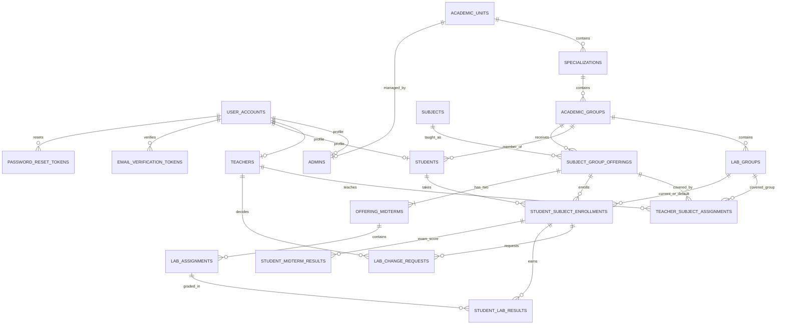

# MySQL ER diagram

This summarizes the active [`schema.mysql.sql`](./schema.mysql.sql). MySQL constraints and triggers in the SQL file define the exact rules.

An offering has two midterms. Lab maximum grades must total exactly 16 before each midterm is locked; every enrolled student must also have all lab grades, attendance marks, and a 0–4 exam score. Each midterm has 20 points overall, and three absences always make a student not allowed. At most 14 labs belong to an offering. A unique key allows one teacher per offering and lab group. Each enrollment retains both its default and current lab group. One pending lab change request is allowed per enrollment.
